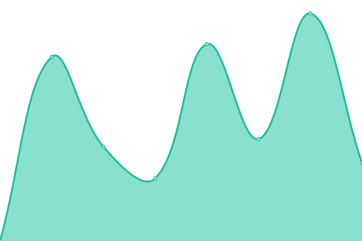
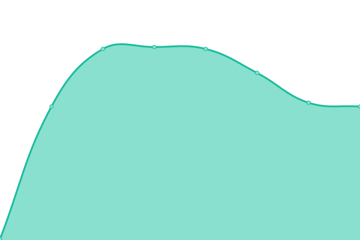
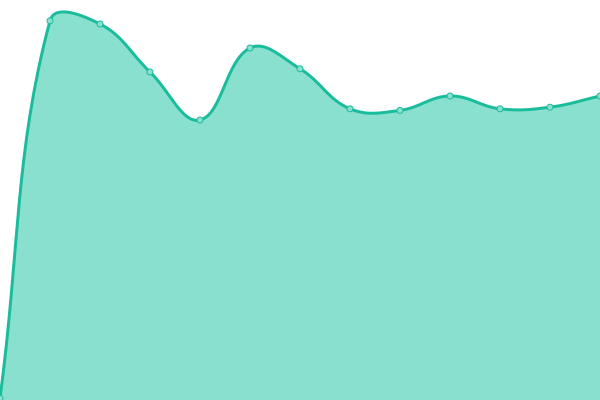

# [📈 Live Status](https://NCU-CSIE-SNMG.github.io/uptime): <!--live status--> **🟩 All systems operational**

This repository contains the open-source uptime monitor and status page for [NCU-CSIE SNMG](http://snmg.csie.ncu.edu.tw), powered by [Upptime](https://github.com/upptime/upptime).

With [Upptime](https://upptime.js.org), you can get your own unlimited and free uptime monitor and status page, powered entirely by a GitHub repository. We use [Issues](https://github.com/NCU-CSIE-SNMG/uptime/issues) as incident reports, [Actions](https://github.com/NCU-CSIE-SNMG/uptime/actions) as uptime monitors, and [Pages](https://NCU-CSIE-SNMG.github.io/uptime) for the status page.

<!--start: status pages-->
<!-- This summary is generated by Upptime (https://github.com/upptime/upptime) -->
<!-- Do not edit this manually, your changes will be overwritten -->
<!-- prettier-ignore -->
| URL | Status | History | Response Time | Uptime |
| --- | ------ | ------- | ------------- | ------ |
|  [CSIE Website](https://www.csie.ncu.edu.tw) | 🟩 Up | [csie-website.yml](https://github.com/NCU-CSIE-SNMG/uptime/commits/HEAD/history/csie-website.yml) | 

 2521ms
     
 | 

<a href="https://NCU-CSIE-SNMG.github.io/uptime/history/csie-website">100.00%</a>
    

|  [CEECS Website](https://www.ceecs.ncu.edu.tw) | 🟩 Up | [ceecs-website.yml](https://github.com/NCU-CSIE-SNMG/uptime/commits/HEAD/history/ceecs-website.yml) | 

 2897ms
     
 | 

<a href="https://NCU-CSIE-SNMG.github.io/uptime/history/ceecs-website">100.00%</a>
    

|  [CSIE Classroom Website](https://classroom.csie.ncu.edu.tw) | 🟩 Up | [csie-classroom-website.yml](https://github.com/NCU-CSIE-SNMG/uptime/commits/HEAD/history/csie-classroom-website.yml) | 

 1973ms
     
 | 

<a href="https://NCU-CSIE-SNMG.github.io/uptime/history/csie-classroom-website">99.05%</a>
    

|  [SNMG Website](https://snmg.csie.ncu.edu.tw) | 🟩 Up | [snmg-website.yml](https://github.com/NCU-CSIE-SNMG/uptime/commits/HEAD/history/snmg-website.yml) | 

 2172ms
     
 | 

<a href="https://NCU-CSIE-SNMG.github.io/uptime/history/snmg-website">99.82%</a>
    

|  [CSIE DNS master](140.115.50.1) | 🟩 Up | [csie-dns-master.yml](https://github.com/NCU-CSIE-SNMG/uptime/commits/HEAD/history/csie-dns-master.yml) | 

 214ms
     
 | 

<a href="https://NCU-CSIE-SNMG.github.io/uptime/history/csie-dns-master">100.00%</a>
    

|  [CSIE DNS slave](140.115.50.2) | 🟩 Up | [csie-dns-slave.yml](https://github.com/NCU-CSIE-SNMG/uptime/commits/HEAD/history/csie-dns-slave.yml) | 

 215ms
     
 | 

<a href="https://NCU-CSIE-SNMG.github.io/uptime/history/csie-dns-slave">100.00%</a>
    

<!--end: status pages-->

[**Visit our status website →**](https://NCU-CSIE-SNMG.github.io/uptime)

## 📄 License

- Powered by: [Upptime](https://github.com/upptime/upptime)
- Code: [MIT](./LICENSE) © [NCU-CSIE SNMG](http://snmg.csie.ncu.edu.tw)
- Data in the `./history` directory: [Open Database License](https://opendatacommons.org/licenses/odbl/1-0/)
